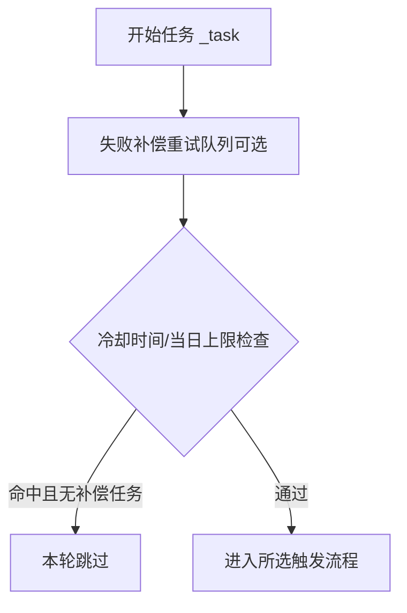
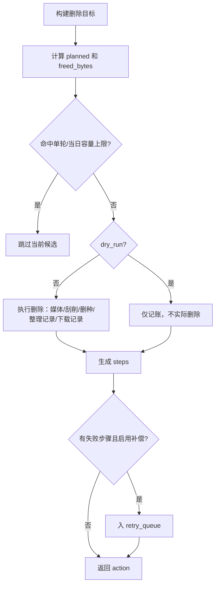
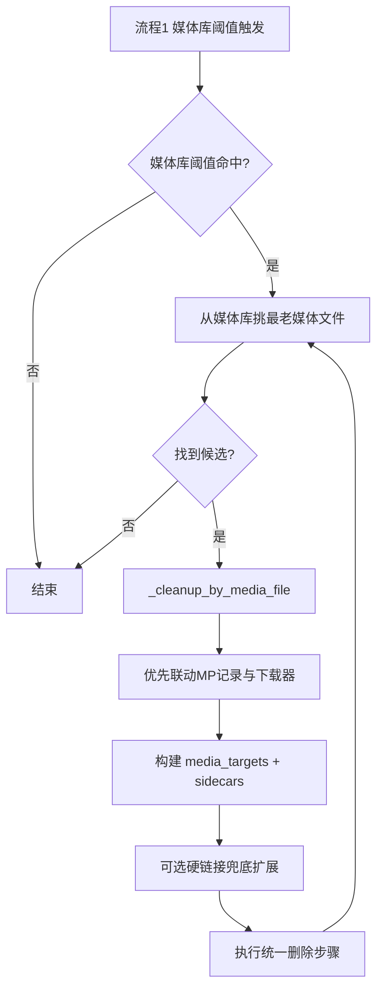
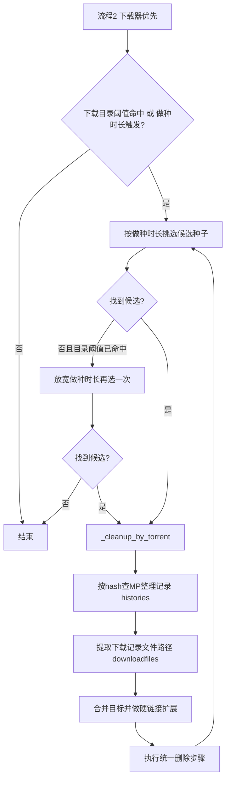
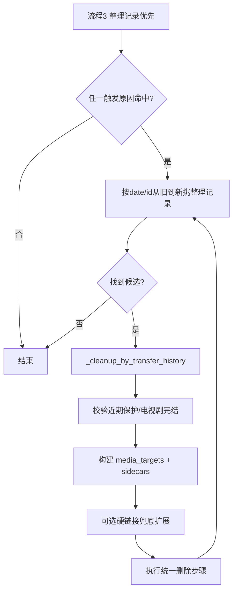

# 磁盘清理（DiskCleaner）使用说明

本文档面向 `v1.7+`，用于快速理解三种触发模式、关键判断关系、参数影响与日志排查方式。

## 0. 近期版本变更

- `v1.7`
  - 新增远程命令：`/clean_local_disk`。
  - 支持在 Telegram / 企业微信直接触发“检查并清理本地磁盘”。
- `v1.6`
  - 基础设置优化：移除“立即运行”开关。
  - 基础开关区改为四项等宽紧凑排列：`启用 / 通知 / 演练 / 清空历史`。
- `v1.5`
  - 修复数据页“立即清理”路径拼接错误：统一改为 `plugin/DiskCleaner/clean + apikey`，避免出现 `/api/v1/api/v1/...` 导致 404。
  - 移除数据页字符串 `onVnodeMounted` 注入，消除 `Invalid value type passed to callWithAsyncErrorHandling(): string` 警告。
  - 三个“立即清理”入口统一可稳定调用 `clean` 接口。
- `v1.4`
  - 重构“立即清理”交互：保留三个入口（配置页 / 数据页固定按钮 / 运行总览按钮），统一直接调用 `clean` 接口；移除 `iframe` 跳转和自动打开日志弹窗逻辑。
- `v1.3`
  - 任务完成日志新增“清理明细汇总”：逐条输出清理目标、触发原因、执行结果、步骤结果与释放容量。
- `v1.2`
  - 新增 `download_hash` 缺失兜底：按媒体文件路径反查下载记录，补全 `hash/downloader`，提升流程1/流程3联动删除下载记录与删种成功率。
- `v1.1`
  - 增强任务完成可读性，增加本轮清理明细开始/结束与逐条摘要日志。
- `v1.0`
  - 删除目标升级为目录级：电影按电影目录删，电视剧按当前识别季目录删（不会整剧删）；执行链路改为“先扫描后删除”；硬链接兜底支持目录级 inode 扫描并统一纳入删除计划。

## 1. 快速上手（推荐）

1. 首次使用建议开启 `dry_run`（演练）先观察日志。
2. 触发流程先选 `flow_library_mp_downloader`（媒体优先）。
3. 阈值建议：
   - 下载目录：`1000G` 或 `10%`
   - 媒体库目录：`1500G` 或 `15%`
4. 确认日志中出现：
   - `本轮空间检查 ...`
   - `流程1媒体候选扫描目录(...)`
   - `开始执行清理计划 ...`
5. 验证无误后关闭 `dry_run` 再执行真实删除。

### 1.1 立即清理入口与行为（v1.4+）

- 一共有三个“立即清理”入口：
  - 配置页底部（`保存` 左侧）
  - 查看数据页底部固定按钮（`配置` 左侧）
  - 查看数据页“运行总览”卡片右侧
- 三个入口行为一致：只调用 `clean` 接口，不会自动打开日志弹窗。
- 触发校验建议：
  - 浏览器 Network 中确认请求：`/api/v1/plugin/DiskCleaner/clean?...`
  - 或在插件日志中确认出现“手动触发”相关日志。

### 1.2 远程命令（v1.7+）

- 命令：`/clean_local_disk`
- 用途：在 Telegram / 企业微信直接触发一次手动清理（等价于点击“立即清理”）。
- 执行反馈：会先回复“开始执行远程命令”，随后回复“命令已受理/未执行”。

## 2. 关键认知（避免误判）

- 空间阈值判定按 `GiB` 计算，UI里可能显示 `TB` 四舍五入。  
  例如可用 `1.00 TB` 可能是 `1025 GiB`，对 `1000G` 阈值仍属于“未命中”。
- `media_servers` / `media_libraries` 现在仅用于“刷新媒体库目标”，不再用于媒体目录路径过滤。
- 演练模式会“连续规划多条候选”，但不会实际释放空间，这是正常现象。

## 3. 模式总览

- 模式一：`flow_library_mp_downloader`（媒体优先，推荐）
- 模式二：`flow_downloader_mp_library`（下载器优先）
- 模式三：`flow_transfer_oldest`（整理记录优先，旧到新）

## 4. 统一执行关系

### 4.1 任务入口

### 4.2 统一删除步骤

## 5. 三种流程图

### 5.1 媒体优先（推荐）

### 5.2 下载器优先

### 5.3 整理记录优先（旧到新）

## 6. 关键参数关系

- `force_hardlink_cleanup`  
  开启后会把下载目录加入删除根范围，并对媒体目标做同 inode 扩展（兜底）。
- `tv_complete_only`  
  仅清理已完结电视剧（TMDB 状态判断）。
- `monitor_download` / `download_threshold_*`  
  资源目录空间告警触发。
- `monitor_library` / `library_threshold_*`  
  媒体库空间告警触发。
- `monitor_downloader` + `seeding_days`  
  下载器做种时长触发。
- `enable_retry_queue`  
  删除步骤失败后入补偿队列重试。
- `media_servers` / `media_libraries`  
  仅用于刷新媒体库目标，不参与清理路径过滤。

## 7. 日志判读（建议对照）

- `本轮空间检查 ...`：确认阈值是否命中（含可用 GiB）。
- `流程1媒体候选扫描目录(...)`：本轮实际扫描目录清单。
- `媒体候选扫描开始 ...`：目录与媒体扩展范围。
- `媒体候选扫描完成 ...`：候选总量/优先类型候选/最终选中目标。
- `开始执行清理计划 ...`：本条计划动作与预计释放容量。
- `流程1未找到可清理的媒体文件；...`：已附完整过滤统计摘要。
- `电影清理目标目录：...`：电影目标已提升为目录级删除。
- `电视剧清理目标识别为季目录：...`：命中当前季目录（直接识别）。
- `电视剧清理目标切换为季目录：A -> B`：由上层目录切换到具体季目录。
- `未能识别电视剧季目录，跳过媒体删除：...`：无法确定当前季，保护性跳过。
- `目录硬链接扫描开始/完成：...`：目录级 inode 扫描与命中统计。
- `下载记录兜底命中：目标=... hash=... downloader=...`：当原始记录缺少 `download_hash/downloader` 时，已通过媒体文件路径反查补全联动上下文。

## 8. 常见问题排查

- 显示 `1.00 TB` 但“资源目录状态正常”  
  先看日志里的 `≈xxxx.xx GiB`，若大于阈值（如 `1000G`）则正常。
- 一直提示“未找到可清理媒体文件”  
  重点看扫描摘要中的：
  - 非媒体扩展过滤数
  - 近期保护过滤数
  - 未完结电视剧过滤数
  - 目录存在数与扫描文件数
- `未找到可删除的下载记录`  
  表示当前候选缺少下载历史映射；`v1.2+` 会先尝试按媒体路径反查 `download_hash/downloader`，仍失败才会提示该日志。
- 电视剧为什么没删  
  先看日志是否出现 `未能识别电视剧季目录`。该场景下会保护性跳过媒体删除，避免误删其他季。
- `Object of type MediaType is not JSON serializable`  
  属于旧版本问题，升级到 `v0.20+` 已修复。

## 9. 选择建议

- 常规环境：选“媒体优先”。
- 下载器占用明显高：选“下载器优先”。
- 需要按历史最旧清理：选“整理记录优先”。
